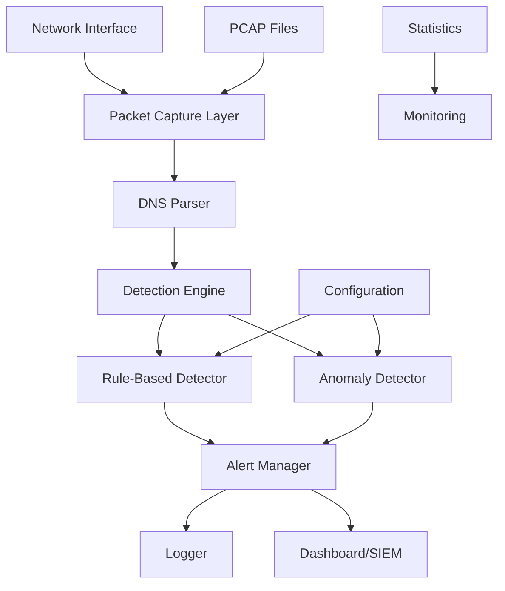
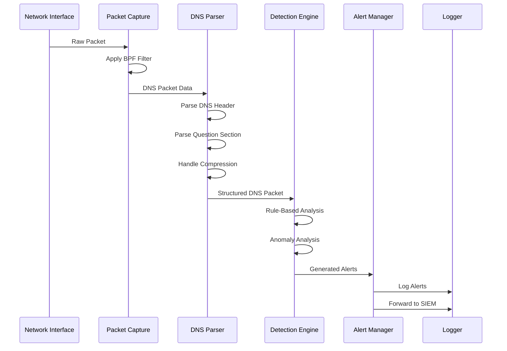

# DNS NIDS Design Document

## Table of Contents
1. [System Overview](#system-overview)
2. [Architecture](#architecture)
3. [Component Design](#component-design)
4. [Data Flow](#data-flow)
5. [Detection Algorithms](#detection-algorithms)
6. [Performance Considerations](#performance-considerations)
7. [Security Model](#security-model)
8. [Scalability](#scalability)

## System Overview

### Purpose
The DNS Network Intrusion Detection System (NIDS) is designed to monitor, analyze, and detect malicious activities in DNS traffic. It provides real-time analysis of DNS packets to identify various attack patterns including DNS tunneling, DDoS attacks, domain generation algorithms (DGA), and other DNS-based threats.

### Design Principles
- **High Performance**: Process thousands of DNS packets per second with minimal latency
- **Accuracy**: Minimize false positives while maintaining high detection rates
- **Modularity**: Loosely coupled components for maintainability and extensibility
- **Configurability**: Flexible rule-based detection with customizable thresholds
- **Standards Compliance**: Full RFC 1035 DNS protocol support

### Key Requirements
- Real-time packet processing from network interfaces
- Offline PCAP file analysis capability
- DNS protocol parsing with compression support
- Rule-based and anomaly-based detection engines
- Structured logging and alerting
- Cross-platform compatibility (Linux, Windows, macOS)

## Architecture

### High-Level Architecture



### Component Hierarchy

```
NIDS Application
├── Packet Capture Layer
│   ├── libpcap Interface
│   ├── Network Interface Management
│   └── PCAP File Reader
├── DNS Protocol Parser
│   ├── Header Parser
│   ├── Question Section Parser
│   ├── Resource Record Parser
│   └── Compression Handler
├── Detection Engine
│   ├── Rule-Based Detector
│   ├── Anomaly Detector
│   └── Alert Generator
├── Utilities
│   ├── Logging System
│   ├── Configuration Manager
│   ├── Statistics Collector
│   └── Network Utilities
└── Main Application
    ├── Command Line Interface
    ├── Signal Handling
    └── Main Processing Loop
```

## Component Design

### 1. Packet Capture Layer (`packet_capture.hpp/.cpp`)

**Purpose**: Interface between network hardware/files and the NIDS application.

**Key Classes**:
- `PacketCapture`: Main capture orchestrator
- `NetworkInterface`: Network interface representation
- `CaptureStats`: Capture statistics

**Responsibilities**:
- Network interface enumeration and management
- Live packet capture using libpcap
- PCAP file reading and processing
- BPF filter application
- Packet queuing and threading

**Design Patterns**:
- **Observer Pattern**: Callback mechanism for packet delivery
- **Strategy Pattern**: Different capture sources (live/file)
- **RAII**: Automatic resource management for libpcap handles

```cpp
class PacketCapture {
    // Configuration
    bool setInterface(const std::string& interface_name);
    bool setFilter(const std::string& filter_expression);
    
    // Capture control
    bool startLiveCapture();
    bool stopCapture();
    
    // Packet processing
    void setPacketCallback(PacketCallback callback);
    void processPackets(int max_packets = -1);
};
```

### 2. DNS Parser (`dns_parser.hpp/.cpp`)

**Purpose**: Complete DNS protocol parser implementing RFC 1035 specification.

**Key Structures**:
- `DNSHeader`: DNS header representation
- `DNSQuestion`: Question section
- `DNSResourceRecord`: Resource record
- `DNSPacket`: Complete parsed packet

**Key Features**:
- **Domain Name Compression**: Handles DNS compression pointers (0xC0xx)
- **Validation**: Comprehensive packet validation
- **Error Handling**: Graceful handling of malformed packets
- **JSON Serialization**: Structured output format

**Parsing Algorithm**:
```
1. Validate minimum packet size
2. Parse fixed 12-byte header
3. For each section (Question, Answer, Authority, Additional):
   a. Parse domain names with compression support
   b. Extract type, class, and other fields
   c. Validate data consistency
4. Create structured DNSPacket object
```

**Compression Handling**:
```cpp
std::string parseDomainName(const uint8_t* data, size_t len, size_t& offset) {
    while (offset < len) {
        uint8_t label_len = data[offset];
        
        if (isCompressedPointer(label_len)) {
            // Handle compression pointer (0xC0xx)
            uint16_t pointer_offset = getCompressionOffset(data, offset);
            // Follow pointer recursively with loop detection
        } else if (label_len == 0) {
            // End of domain name
            break;
        } else {
            // Regular label
            extract_label(data, offset, label_len);
        }
    }
}
```

### 3. Detection Engine (`detector.hpp/.cpp`)

**Purpose**: Core threat detection using multiple detection methodologies.

**Detection Types**:
1. **Rule-Based Detection**: Pattern matching against known attack signatures
2. **Anomaly Detection**: Statistical analysis of traffic patterns
3. **Hybrid Detection**: Combination of rule and anomaly-based methods

**Key Classes**:
- `DNSDetector`: Main detection orchestrator
- `DNSRule`: Rule representation
- `DNSAlert`: Alert structure
- `TrafficStats`: Traffic statistics
- `IPStats`: Per-IP statistics

#### Rule-Based Detection

**Supported Rules**:
- **DNS-001**: Long domain names (>100 characters)
- **DNS-002**: Suspicious query types (TXT, ANY, NULL)
- **DNS-003**: DNS flooding (>1000 queries/second per IP)
- **DNS-004**: Malformed DNS packets
- **DNS-005**: DGA domain detection (high entropy)
- **DNS-006**: NXDOMAIN bursts (>50% failure rate)

**Rule Engine Design**:
```cpp
class RuleEngine {
    std::vector<DNSRule> rules;
    
    std::vector<DNSAlert> checkRules(const DNSPacket& packet) {
        std::vector<DNSAlert> alerts;
        
        for (const auto& rule : rules) {
            if (rule.enabled && evaluateCondition(rule, packet)) {
                alerts.push_back(createAlert(rule, packet));
            }
        }
        
        return alerts;
    }
};
```

#### Anomaly Detection

**Statistical Methods**:
1. **Baseline Learning**: Establish normal behavior patterns
2. **Sliding Window**: Maintain temporal statistics
3. **Threshold Detection**: Compare current vs. baseline metrics
4. **Z-Score Analysis**: Statistical deviation calculation

**Metrics Tracked**:
- Query volume per IP address
- Query type distribution
- Response code patterns
- Domain name entropy
- TTL values
- Query timing patterns

**Anomaly Algorithm**:
```
For each IP address:
1. Maintain sliding window of query rates
2. Calculate baseline (mean, standard deviation)
3. Compare current rate to baseline
4. If deviation > threshold * std_dev:
   - Generate anomaly alert
   - Update baseline gradually
```

### 4. Alert Management

**Alert Processing Pipeline**:
```
Detection Engine → Alert Generator → Alert Processor → Output Handlers
                                  ↓
                              Alert Correlation
                                  ↓
                              Priority Ranking
                                  ↓
                           Rate Limiting/Suppression
```

**Alert Structure**:
```json
{
  "timestamp": "ISO8601",
  "rule_id": "string",
  "severity": "low|medium|high|critical",
  "description": "string",
  "source_ip": "string",
  "dest_ip": "string", 
  "query_name": "string",
  "query_type": "integer",
  "details": "string"
}
```

## Data Flow

### Packet Processing Flow



### Memory Management

**Packet Lifecycle**:
1. **Capture**: Raw packet captured by libpcap
2. **Parse**: DNS packet parsed into structured format
3. **Analyze**: Packet analyzed by detection engines
4. **Alert**: Alerts generated and processed
5. **Cleanup**: Memory released after processing

**Memory Optimization**:
- **Zero-Copy**: Minimize data copying where possible
- **Object Pooling**: Reuse packet objects
- **RAII**: Automatic resource management
- **Smart Pointers**: Prevent memory leaks

## Detection Algorithms

### 1. Domain Generation Algorithm (DGA) Detection

**Approach**: Entropy-based analysis with pattern recognition

**Algorithm**:
```cpp
bool isDGA(const std::string& domain) {
    // Calculate Shannon entropy
    double entropy = calculateEntropy(domain);
    if (entropy < DGA_ENTROPY_THRESHOLD) return false;
    
    // Check for suspicious patterns
    if (containsLongRandomStrings(domain)) return true;
    if (hasUncommonCharacterDistribution(domain)) return true;
    
    // Check against whitelist
    if (isWhitelisted(domain)) return false;
    
    return entropy > DGA_ENTROPY_THRESHOLD;
}

double calculateEntropy(const std::string& str) {
    std::map<char, int> freq;
    for (char c : str) freq[c]++;
    
    double entropy = 0.0;
    for (const auto& p : freq) {
        double prob = (double)p.second / str.length();
        entropy -= prob * log2(prob);
    }
    
    return entropy;
}
```

### 2. DNS Tunneling Detection

**Indicators**:
- Unusually long domain names
- High frequency of TXT queries
- Large DNS response sizes
- Uncommon query patterns

**Detection Logic**:
```cpp
bool checkDNSTunneling(const DNSPacket& packet) {
    // Check domain length
    if (packet.questions[0].qname.length() > MAX_NORMAL_LENGTH) {
        return true;
    }
    
    // Check query type patterns
    if (isUncommonQueryType(packet.questions[0].qtype)) {
        return checkQueryFrequency(packet.source_ip);
    }
    
    // Check payload size
    if (packet.packet_size > NORMAL_DNS_SIZE_THRESHOLD) {
        return true;
    }
    
    return false;
}
```

### 3. Fast Flux Detection

**Characteristics**:
- Rapid IP address changes for same domain
- Short TTL values
- Multiple A records

**Algorithm**:
```cpp
bool checkFastFlux(const DNSPacket& packet) {
    const std::string& domain = packet.questions[0].qname;
    
    // Track IP changes for this domain
    auto& history = domain_ip_history[domain];
    
    // Check TTL
    if (getMinTTL(packet) < FAST_FLUX_TTL_THRESHOLD) {
        // Count IP changes in time window
        int changes = countIPChanges(history, TIME_WINDOW);
        return changes > FAST_FLUX_CHANGE_THRESHOLD;
    }
    
    return false;
}
```

## Performance Considerations

### Throughput Requirements

**Target Performance**:
- 50,000+ DNS packets/second processing
- <10ms average packet processing latency
- <100MB memory usage for 10,000 monitored IPs
- <5% CPU utilization under normal load

### Optimization Strategies

1. **Lock-Free Programming**:
   ```cpp
   class LockFreeStats {
       std::atomic<uint64_t> packet_count{0};
       std::atomic<uint64_t> alert_count{0};
       
       void incrementPackets() {
           packet_count.fetch_add(1, std::memory_order_relaxed);
       }
   };
   ```

2. **Memory Pool Allocation**:
   ```cpp
   class PacketPool {
       std::queue<std::unique_ptr<DNSPacket>> available;
       
       std::unique_ptr<DNSPacket> acquire() {
           if (available.empty()) {
               return std::make_unique<DNSPacket>();
           }
           auto packet = std::move(available.front());
           available.pop();
           return packet;
       }
   };
   ```

3. **SIMD Optimization**:
   - Vectorized string operations for domain parsing
   - Parallel entropy calculations
   - Batch processing of similar operations

4. **Cache-Friendly Data Structures**:
   - Compact packet representations
   - Sequential memory layouts
   - Predictable access patterns

### Profiling and Monitoring

**Key Metrics**:
- Packets processed per second
- Memory usage trends
- CPU utilization
- Alert generation rates
- False positive rates

**Profiling Tools**:
- gprof for CPU profiling
- Valgrind for memory analysis
- perf for system-level profiling

## Security Model

### Threat Model

**Assets Protected**:
- Network DNS traffic integrity
- Detection system availability
- Alert data confidentiality

**Threat Actors**:
- External attackers using DNS for C&C
- Malicious insiders
- Automated malware

**Attack Vectors**:
- DNS tunneling for data exfiltration
- DDoS attacks via DNS amplification
- DNS spoofing and cache poisoning
- Evasion techniques

### Security Controls

1. **Input Validation**:
   ```cpp
   bool validateDNSPacket(const uint8_t* data, size_t len) {
       if (!data || len < DNS_HEADER_SIZE) return false;
       if (len > MAX_DNS_PACKET_SIZE) return false;
       
       // Validate header fields
       DNSHeader header;
       if (!parseHeader(data, len, header)) return false;
       
       // Check for reasonable field values
       if (header.qdcount > MAX_QUESTIONS ||
           header.ancount > MAX_ANSWERS) return false;
           
       return true;
   }
   ```

2. **Resource Limits**:
   - Maximum memory per IP address
   - Alert rate limiting
   - CPU usage monitoring

3. **Privilege Separation**:
   - Minimal required privileges
   - Separate capture and analysis processes
   - Chroot jails where applicable

## Scalability

### Horizontal Scaling

**Distributed Architecture**:
```
Load Balancer
    ├── NIDS Instance 1 (Interface eth0)
    ├── NIDS Instance 2 (Interface eth1)
    └── NIDS Instance N (Interface ethN)
            ↓
    Central Alert Aggregator
            ↓
    SIEM / Security Dashboard
```

**Scaling Strategies**:
1. **Per-Interface Deployment**: One NIDS instance per network interface
2. **Geographic Distribution**: NIDS instances at different locations
3. **Load Balancing**: Distribute traffic across multiple instances

### Vertical Scaling

**Multi-threading Design**:
```cpp
class ThreadedNIDS {
    std::thread capture_thread;
    std::thread parser_thread;
    std::thread detection_thread;
    std::thread alert_thread;
    
    // Lock-free queues for inter-thread communication
    LockFreeQueue<RawPacket> raw_packets;
    LockFreeQueue<DNSPacket> parsed_packets;
    LockFreeQueue<DNSAlert> alerts;
};
```

**Processing Pipeline**:
1. **Capture Thread**: Packet capture from network
2. **Parser Thread**: DNS protocol parsing  
3. **Detection Thread**: Threat analysis
4. **Alert Thread**: Alert processing and forwarding

### Cloud Deployment

**Container Architecture**:
```dockerfile
FROM alpine:latest
RUN apk add --no-cache libpcap-dev
COPY nids_dns /usr/local/bin/
COPY rules/ /etc/nids/rules/
ENTRYPOINT ["/usr/local/bin/nids_dns"]
```

**Kubernetes Deployment**:
```yaml
apiVersion: apps/v1
kind: DaemonSet
metadata:
  name: dns-nids
spec:
  selector:
    matchLabels:
      app: dns-nids
  template:
    spec:
      hostNetwork: true
      containers:
      - name: dns-nids
        image: dns-nids:latest
        securityContext:
          capabilities:
            add: ["NET_RAW", "NET_ADMIN"]
```

---

This design document provides the foundational architecture for a robust, scalable DNS NIDS capable of detecting modern DNS-based threats while maintaining high performance and accuracy.
